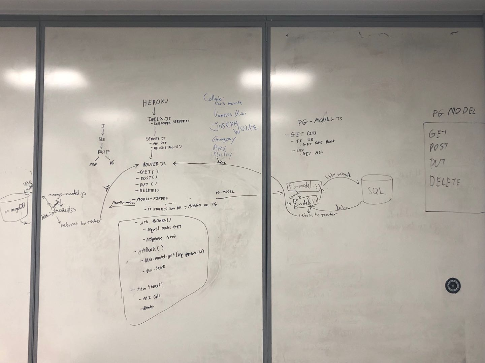

 PROJECT
=================================================

## Book App v2

### Author: Vanessa

### Links and Resources
* [PR][1]
* [travis][2]
* [front-end][https://dashboard.heroku.com/apps/warm-river-62437/resources]

#### Documentation

* [jsdoc][6]

### Modules

#### `routes/`
* ##### `create-book.js`
* ##### `create-search.js`
* ##### `delete-book.js`
* ##### `get-book.js`
* ##### `get-books.js`
* ##### `new-search.js`
* ##### `update-book.js`
#### `middleware/`
* ##### `404.js`
* ##### `500.js`
* ##### `model-finder.js`
#### `models/`
* ##### books
* ##### bookshelves

### Setup
#### `.env` requirements
* `npm i`
* `PORT` - assign a port number
* `DATABASE_URL` - URL to postgres database
* `MONGODB_URI` - URL to the running mongo database

#### Running the app
* `npm start`
* Endpoint: `/`
  * Renders a view of all books in the database
* Endpoint: `/books/:id`
  * Renders a view of a single book and it's detailed information
* Endpoint: `/searches/new`
  * Renders a search form to look up a book with the Google Books API

#### Tests
* How do you run tests?
  * `npm run test`
  * `npm run lint`
<!-- * What assertions were made?
* What assertions need to be / should be made? -->

#### UML
 

#### Collaborators
Chris Merrit, Vanessa Wei, Joseph Wolfe, Gregory Dukes, and Alexander White.
